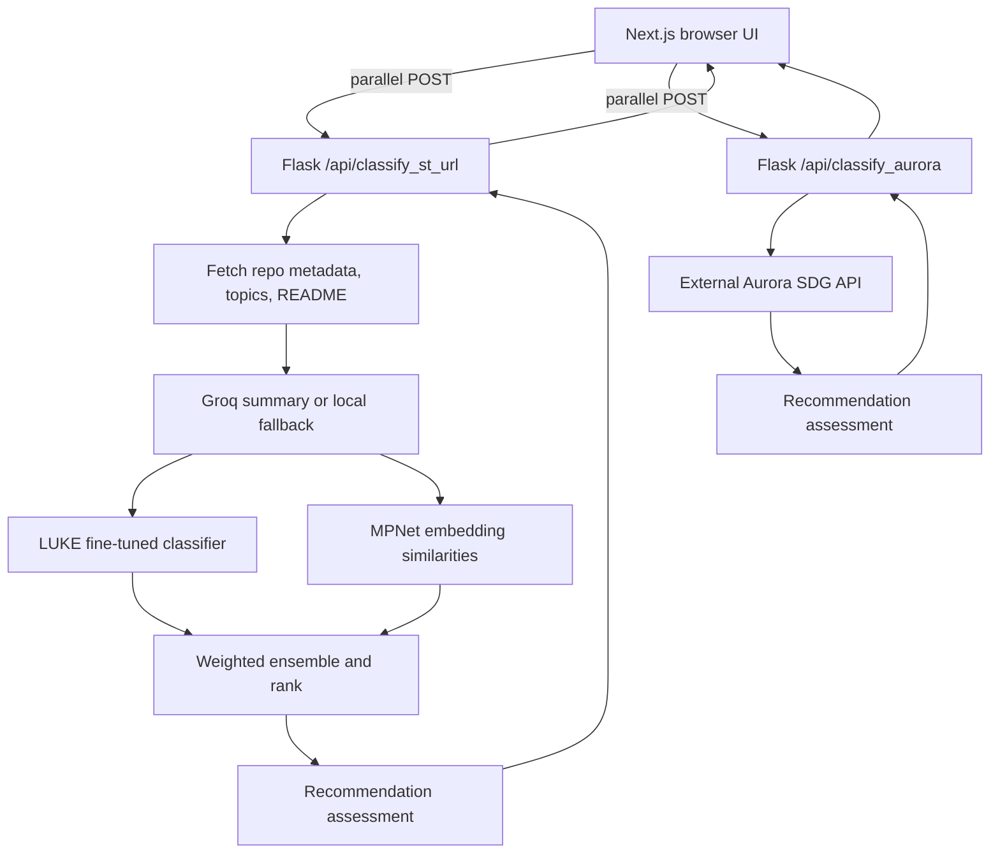

# Classification Architecture and Latency

This document describes how the application's classification paths work, how the LUKE and MPNet models are loaded and reused, where request time is spent, and how to interpret latency estimates. It reflects the current implementation in this repository.

> **Latency caveat:** The project does not currently record per-stage timings or provide a representative model benchmark. All timing ranges below are rough planning estimates, not measurements or service-level guarantees. Real results depend on the CPU/GPU, model cache state, input length, network, Git forge, Groq, Aurora, and backend deployment configuration.

## Contents

- [System at a glance](#system-at-a-glance)
- [Two classification paths](#two-classification-paths)
- [Repository and README path](#repository-and-readme-path)
- [LUKE classifier](#luke-classifier)
- [MPNet embeddings and ensemble](#mpnet-embeddings-and-ensemble)
- [Recommendation assessment](#recommendation-assessment)
- [Model lifecycle and efficiency](#model-lifecycle-and-efficiency)
- [Latency: stages and estimates](#latency-stages-and-estimates)
- [Browser-visible wait time](#browser-visible-wait-time)
- [Important caveats and optimization opportunities](#important-caveats-and-optimization-opportunities)
- [Source map](#source-map)

## System at a glance

The application has a Next.js frontend and a Flask backend. The browser submits two requests at the same time:

1. `POST /api/classify_st_url` analyzes repository content using the local LUKE + MPNet pipeline.
2. `POST /api/classify_aurora` sends the user's project description to the external Aurora SDG API.

The frontend prefers the repository result if it completes successfully. Aurora is the fallback if the repository request fails or exceeds the frontend's 120-second wait limit. The two backend requests run independently; the frontend does not combine their scores.



The diagram shows the logical request flow. MPNet may also be invoked by the recommendation assessment; that check is not a separate API request.

## Two classification paths

### ST URL path

The repository path uses the user-provided repository URL and description. It fetches repository content, derives a short classification-oriented text, scores the text with two models, ensembles the results, and filters them for the API response.

The backend flow is approximately:

```text
POST /api/classify_st_url
  -> validate description and URL
  -> fetch repository metadata, topics, and README
  -> summarize README (Groq) or construct fallback summary
  -> truncate classification text to 6,000 characters
  -> LUKE: predict 17 SDG scores
  -> MPNet: score text against 17 SDG descriptions
  -> combine scores, rank, select scores >= 0.3
  -> assess relevance for a possible empty-result explanation
  -> API route retains scores strictly > 0.4
  -> return JSON
```

`classify_repo()` initially selects scores greater than or equal to `0.3`. The Flask route then applies a second filter and returns only scores strictly greater than `0.4`, so a score of exactly `0.4` is not returned. The function's `top_k` limit is 10.

### Aurora path

The Aurora route sends the user's project description to `https://aurora-sdg.labs.vu.nl/classifier/classify/elsevier-sdg-multi`. It does not fetch the repository or call the local LUKE classifier. The response is normalized, scores above `0.1` are retained in `aurora_api.py`, and the Flask route applies its own strict `> 0.4` output filter.

Both routes perform a recommendation assessment after classification. Its result is attached only if no prediction remains after the route's `> 0.4` filter, but the assessment function itself is called whether or not predictions remain. Depending on text length and keywords, that assessment can do additional MPNet work even when the recommendation field is ultimately `null`.

## Repository and README path

### Fetch stage

`fetch_repo_text()` obtains metadata, topics, and README content from a provider selected for the repository host. For GitHub these are currently sequential calls:

1. Repository metadata (`fetch_meta()`).
2. Topics (`fetch_topics()`). This currently makes another repository API request, even though it uses the same endpoint as metadata.
3. README (`fetch_readme()`).

Provider implementations for GitLab, Codeberg, Bitbucket, and self-hosted instances can use different endpoints and may perform a different number of requests. Calls are synchronous, so their network times add together rather than overlapping. The shared provider GET helper uses a 30-second request timeout. Metadata/topics/README provider errors are handled individually in `fetch_repo_text()`, allowing later fetch steps to continue.

The user's description takes priority over the repository metadata description when forming summarizer input. Repository name, topics, metadata description, and README text are then passed to the summarizer.

### Summary stage

With `GROQ_API_KEY` configured, `summarize_for_sdg()` cleans the README, removes several types of Markdown/HTML noise, truncates the text sent to Groq to 12,000 characters, and calls the Groq chat completions API. It requests a compact classification-oriented response and has a 30-second HTTP timeout. On request errors, invalid/short responses, or other handled failures, it returns a locally assembled fallback rather than stopping the classification request.

Without a Groq key, the fallback is returned immediately. That fallback is composed from the repository name, description, topics, and a failure reason. The resulting summary is truncated to 6,000 characters before it is passed to the classifiers. Thus the Groq request can dominate the external preprocessing time, but it is optional.

## LUKE classifier

### Model identity and loading

The local classifier uses:

- Base architecture/configuration ID: `studio-ousia/luke-large-lite`.
- Fine-tuned checkpoint: `GE-Lab/SDGs-classifier`, file `best_model.pt`.
- 17 output classes, one per SDG.

The configuration and tokenizer are fetched through Hugging Face Transformers. The model architecture is created with `AutoModel.from_config(AutoConfig.from_pretrained(...))`, which creates the parameter structure without downloading the base model's pretrained weights. The fine-tuned checkpoint is then downloaded or read from the Hugging Face cache and loaded into that architecture.

This avoids downloading a large base weight set only to overwrite it with fine-tuned weights. `_assert_checkpoint_covers_model()` checks that the checkpoint contains every expected parameter, and `load_state_dict(..., strict=True)` checks the full state-dict match. If the checkpoint is incomplete, loading fails instead of silently leaving random model parameters behind.

The entire load is lazy. Importing `services.inference` does not load the large weights. The first call to `predict_scores()` calls `load()`, then saves the model, tokenizer, and device in module-level variables. Later calls in the same backend process reuse them. The loader is idempotent once `_model` is populated.

### Per-text inference

For each input text, `predict_scores()`:

1. Tokenizes with special tokens, truncation at 512 tokens, and padding to a fixed length of 512.
2. Moves the encoded inputs to the selected device (`cuda` when `torch.cuda.is_available()`, otherwise CPU).
3. Adds a position tensor and a zero-valued labels tensor required by this model's forward signature.
4. Runs the model under `torch.no_grad()`.
5. Applies sigmoid to 17 logits, copies the scores back to CPU, and rounds each score to four decimals.

The LUKE model averages final hidden states using the attention mask, applies a learned pooler, dropout and `tanh`, then applies the 17-output classification layer. The checkpoint's custom pooler is installed as `self.bert.pooler` to match checkpoint parameter names.

On CUDA, the model is converted to half precision before it is moved to the device and set to evaluation mode. On CPU, it remains in its default precision. This implementation does not use an explicit batch: it predicts one text at a time.

## MPNet embeddings and ensemble

The embedding model is `sentence-transformers/all-mpnet-base-v2`, loaded by `SentenceTransformer` from `services/embedder.py`. The accessor keeps one module-level instance for the lifetime of the backend process. This is shared by the repository classifier and the recommendation helper, preventing both modules from holding separate copies of MPNet weights.

For the repository ensemble, `embedding_similarity_scores()` encodes:

- The repository summary text (one embedding).
- All 17 SDG description strings (17 embeddings).

Embeddings are normalized. The code takes dot products of each SDG vector with the summary vector, which are cosine similarities for normalized vectors. Each similarity is mapped linearly using `COSINE_LOW = 0.27` and `COSINE_HIGH = 0.34`, then clipped to `[0, 1]`:

```text
embedding_score = clip((cosine_similarity - 0.27) / (0.34 - 0.27), 0, 1)
```

The classifier and embedding scores are combined with `alpha=0.3`:

```text
ensemble_score = 0.3 * LUKE_score + 0.7 * MPNet_score
```

The resulting 17 scores are ranked, thresholded, and limited to the top 10. The ST route converts the selected scores to three decimal places for its output. The exact thresholds and rounding are consequential: LUKE's own scores are rounded to four decimals, classifier selection initially uses `>= 0.3`, and the Flask route response uses `> 0.4`.

### Repeated MPNet work

MPNet model weights are reused, but the 17 SDG description embeddings are not cached in the current code. They are recalculated during each repository classification. The recommendation check can also encode those same descriptions again when its keyword and length checks pass. This is repeated inference work, not repeated model loading.

## Recommendation assessment

`assess_relevance(description, readme_or_summary)` is a deterministic post-classification helper, not a third classifier and not a replacement for LUKE/MPNet ensemble scores.

It cleans both arguments and checks their combined text in this order:

1. Fewer than 20 words: return `text_too_short` without using MPNet.
2. Search for explicit SDG, domain, or problem/beneficiary keywords.
3. If a keyword signal is found, load/reuse MPNet, encode the user's description and the 17 SDG descriptions, and find the maximum cosine similarity. It uses a fixed `0.25` decision boundary.
4. If there is no signal, return either `heavily_technical` or `no_sdg_signals` without MPNet.

Important input detail: the combined description plus summary is used for the word count and keyword checks, but the similarity calculation embeds only `user_description`. In the ST route, the second argument is the generated summary (or repository description fallback); in the Aurora route, the current Aurora response normally has no `project_description`, so the helper usually receives an empty second string.

The recommendation calculation runs after the route's primary classification. If the route returns one or more predictions above `0.4`, its recommendation result is discarded from the response. The recommendation check can nevertheless add time in that case if the text passes its length and keyword gates.

## Model lifecycle and efficiency

### Work avoided

- **No large model load during module import:** LUKE and MPNet load lazily.
- **No duplicate base LUKE checkpoint download:** architecture is built from config, and the fine-tuned checkpoint supplies all parameters.
- **No repeated model construction per request:** both loaded model objects are module-level singletons reused by subsequent calls in the same process.
- **No gradient calculation for prediction:** LUKE runs under `torch.no_grad()` and is put in evaluation mode.
- **Reduced GPU parameter precision:** LUKE uses half precision when CUDA is available.
- **One shared MPNet accessor:** repository scoring and recommendation use the same process-wide embedder.
- **A fallback when Groq is unavailable:** no configured key skips the external summary request; handled Groq failures do not necessarily abort classification.

### Work still performed on every request

- The backend makes repository network calls each time the ST route is submitted; no repository-response cache is present in this path.
- Groq is called on each request when configured; cache code in the summarizer is commented out.
- LUKE tokenizes and infers for each repository summary.
- MPNet re-encodes the summary and 17 descriptions for the ensemble; its description vectors are not cached.
- The recommendation helper may repeat an MPNet pass after the ensemble.

### Memory and startup

The inference module describes the LUKE weight load as approximately 1.7 GB, and the MPNet accessor comments describe about 420 MB for the previously duplicated MPNet copies. These are code comments/rough model footprint references, not measurements of the complete process's peak RAM or VRAM. Actual memory use includes runtime libraries, model activations, tensors, allocator overhead, and the rest of Flask.

A fresh backend process must construct the models again. Hugging Face may reuse files from its local cache, avoiding a fresh network download, but the weights still have to be loaded into process memory. Because loading is lazy, a process can bind its HTTP port before model initialization, while the first prediction request pays the model initialization cost.

## Latency: stages and estimates

There are no `perf_counter`, request-duration, or per-model timing metrics in the relevant implementation. The following ranges are deliberately broad, warm-request estimates for an ordinary development environment; they should not be treated as observed values. GPU figures assume a usable local CUDA GPU and correctly installed GPU-enabled PyTorch.

| Stage | Warm rough estimate | Notes |
|---|---:|---|
| Browser to local Flask backend and response transfer | 1-30 ms | Same-machine/local network estimate; deployed network adds its own RTT. |
| URL validation and Python orchestration | Usually under 20 ms | Excludes network and model work. |
| Repository metadata, topics, and README fetch | About 0.3-3 s in a healthy network | Calls are serial. Host/API/network variability can make this much longer. The shared provider GET timeout is 30 seconds per call; three sequential calls can therefore make failure cases very slow. |
| README cleaning and prompt construction | Usually under 100 ms | Depends mainly on README size and text cleaning. |
| Groq summarization | Often about 0.5-10 s | External service, request size, model load, and queueing affect this. Configured HTTP timeout is 30 seconds; errors fall back. With no key it is effectively skipped. |
| Warm LUKE inference on CPU | Roughly 1-8 s | Highly dependent on CPU, thread settings, and actual tokenized length. Input is padded to 512 tokens. |
| Warm LUKE inference on CUDA GPU | Roughly 0.1-1 s | Broad estimate only; GPU, memory bandwidth, and software configuration matter. |
| Warm MPNet scoring on CPU | Roughly 0.2-1.5 s | Includes encoding one summary and 17 descriptions; no description-embedding cache. |
| Warm MPNet scoring on GPU | Roughly 0.03-0.4 s | Broad estimate, batch size and hardware dependent. |
| Recommendation checks without MPNet | Usually under 10 ms | Mostly regular expressions, keyword checks, and word counting. |
| Recommendation MPNet branch | Add roughly 0.1-1.5 s CPU or 0.02-0.4 s GPU | Only when combined text has at least 20 words and keyword signals. May add the first MPNet load if MPNet has not yet been used in this process. |
| Ranking, thresholding, and JSON formatting | Usually under 20 ms | Small arrays of 17 scores. |

### Approximate end-to-end totals

For the ST URL route, a warm CPU-backed request might commonly fall around **2-15 seconds when external services are responsive**. A GPU can make LUKE and MPNet faster, but it does not reduce the time to fetch the repo or wait for Groq. A slow forge or Groq call can push the request well beyond that range.

For a warm request with no Groq key, the summarization call is skipped. A healthy repository fetch plus local inference might therefore be roughly **2-10 seconds on CPU**, with broad variation by machine and network.

For a fresh process, do not use those warm estimates. The first request can additionally pay for tokenizer/config resolution, checkpoint loading, MPNet loading, and possibly network downloads if model assets are not cached. The LUKE checkpoint is large; cold startup can range from tens of seconds to minutes, especially on CPU, slow storage, or a cold/slow model download. Subsequent calls in that process avoid model construction, but not per-input inference.

For the Aurora route, latency is primarily the browser/backend round trip, the external Aurora request, and any conditional recommendation embedding. The Aurora request in `aurora_api.py` does not set an explicit timeout, so its maximum wait is not bounded by this code. Do not assume its latency is comparable to local inference.

### What “RTT” means here

An application request has more than one network round trip:

- Browser -> Flask backend -> browser is one user-visible API request/response.
- The ST route then makes multiple backend -> repository-host requests, one after another.
- With Groq configured, it also makes a backend -> Groq request before local model inference.
- With `MODEL_SERVICE_URL` configured, LUKE inference adds a backend -> model-service HTTP request. By default, LUKE runs in the backend process and that extra hop is absent.
- The Aurora route makes a backend -> Aurora request.

For serial stages, wall time is approximately the sum of stage durations. For the two frontend requests, the requests overlap, but the frontend's selection logic is asymmetric, as described below.

## Browser-visible wait time

On form submission, `mainScreen.tsx` starts both API calls without awaiting either first. It then waits up to 120 seconds for the ST URL request. If that request succeeds, the ST result is selected even if Aurora finished sooner. If ST rejects or reaches the 120-second timeout, the UI awaits the Aurora promise; if Aurora already completed, it can be returned immediately at that point.

Therefore, for a successful ST request:

```text
visible wait ~= ST request duration
```

For an ST error before the timeout:

```text
visible wait ~= max(time until ST error, time until Aurora response)
```

For an ST request that hangs until the frontend timeout:

```text
visible wait ~= max(120 seconds, time until Aurora response)
```

The 120-second timer is a frontend fallback threshold, not a backend timeout. It does not cancel the ST request. The Aurora promise is started concurrently and a rejection handler is attached, but the frontend does not choose a successful Aurora result early while ST is still pending.

## Important caveats and optimization opportunities

1. **Do not present the estimates as measured.** Add stage timers around repository fetching, summarization, LUKE, MPNet, recommendation, and total Flask route duration before making performance claims. Record cold versus warm requests separately.
2. **Cache the 17 MPNet SDG description vectors.** Those strings are constant within the process, so their normalized embeddings can be computed once after MPNet loads and reused. Any such change should preserve the model and normalization semantics.
3. **Review LUKE's fixed padding and output flags.** Fixed 512-token padding does unnecessary work for short inputs. The forward pass requests attentions and hidden states even though it only consumes `last_hidden_state`; confirm checkpoint/API behavior before disabling these outputs or changing tokenization, and compare score parity.
4. **Remove duplicate GitHub metadata retrieval if practical.** `fetch_meta()` and `fetch_topics()` currently issue separate calls to the same repository endpoint. A combined provider method or cached response could reduce one network RTT for GitHub.
5. **Decide whether Groq is required for every run.** It is often a major serial wait. The local fallback already exists; caching summaries or allowing an explicit local-only mode could reduce latency, but would affect classification inputs and should be measured for score quality.
6. **Bound and observe external calls.** Provider fetches have a 30-second per-call timeout; Groq has 30 seconds; Aurora currently has no explicit timeout. Add an Aurora timeout and sensible production limits if predictable request duration is required.
7. **Check deployment concurrency.** Module-level singletons mean one model copy per Python process. Multiple worker processes can each load their own LUKE and MPNet models, multiplying memory requirements. A production deployment should size workers for available RAM/VRAM rather than assuming all workers share Python model memory.
8. **Consider first-request warm-up.** Lazy loading reduces startup blocking but makes the first classification request slower. A controlled readiness/warm-up step can move that cost to deployment startup if the service's memory and startup budget allow it.
9. **Avoid accidental external fallback expectations.** The UI's 120-second timeout does not terminate backend work. A request that times out in the browser may continue consuming backend/network/model resources until the server-side work finishes or fails.

## Source map

- [frontend/components/mainScreen.tsx](frontend/components/mainScreen.tsx): parallel request launch, preference for ST URL, and 120-second frontend fallback.
- [frontend/services/api.ts](frontend/services/api.ts): frontend endpoints and backend base URL.
- [backend/app.py](backend/app.py): Flask routes, recommendation invocation, and final `> 0.4` filtering.
- [backend/embedding_url.py](backend/embedding_url.py): repository fetch/summarizer orchestration, LUKE/MPNet scoring, ensemble, ranking, and output shape.
- [backend/services/inference.py](backend/services/inference.py): lazy LUKE loading, checkpoint validation, device selection, tokenization, inference, and score rounding.
- [backend/services/sdg_model.py](backend/services/sdg_model.py): LUKE architecture, pooling, and forward pass.
- [backend/services/embedder.py](backend/services/embedder.py): lazy shared MPNet accessor.
- [backend/services/repo_fetcher.py](backend/services/repo_fetcher.py): repository providers, network timeout, and provider error mapping.
- [backend/services/summariser.py](backend/services/summariser.py): Groq request, timeout, cleaning, and fallback summary.
- [backend/services/recommendation_pipeline.py](backend/services/recommendation_pipeline.py): post-classification text checks and optional MPNet similarity assessment.
- [backend/aurora_api.py](backend/aurora_api.py): external Aurora request and response normalization.
